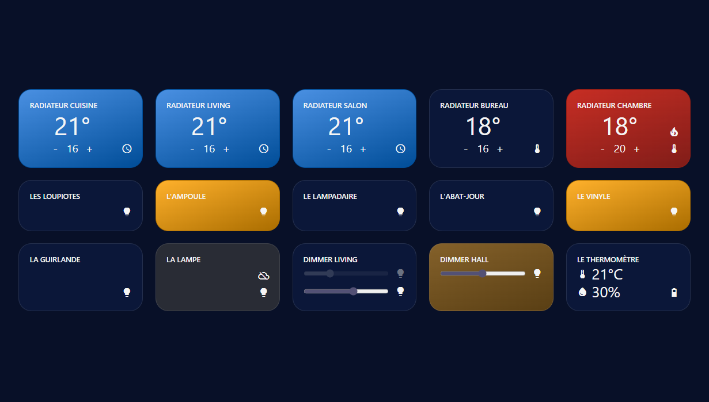

# MachOne

Web app to control Tuya devices

## Use

You can access app here:
[machone.onrender.com](https://machone.onrender.com/)

You need to pass some data as query params:

- appKey=APP_KEY
- secretKey=SECRET_KEY
- devices=DEVICE_ID_1,DEVICE_ID_2,... (not possible to retrieve all devices with Tuya API, order will be respect to display)

You can create appKey and secretKey on [platform.tuya.com/cloud](https://platform.tuya.com/cloud)

- Create Cloud Project (for appKey & secretKey)
- Devices > Link App Account (for devices ids)

This data is directly sent to Tuya API without being saved.
Otherwise you can also launch the project easily on your side!

## Install

- `npm install`

## Start

- Back (NestJS)

  `npm run start:back`

- Front (Angular)

  `npm run start:front`
